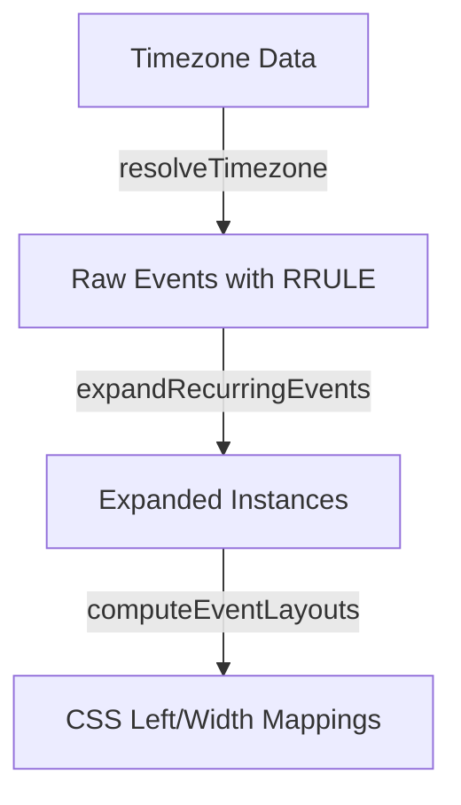

# Recurrence Calendar Lib

A timezone-correct recurrence expansion and calendar layout engine.

## Features

- **RRULE Expansion**: Expand repeating events safely within boundaries using `date-fns-tz` and `rrule`.
- **Timezone Safety**: Correctly maps dates and boundaries without leaking local time offsets.
- **Event Packing Algorithm**: Automatically calculates CSS `left` and `width` percentages for overlapping events on a daily/weekly grid.

## Installation

```bash
npm install recurrence-calendar-lib
```

## Quick Start

```typescript
import { expandRecurringEvents, computeEventLayouts } from "recurrence-calendar-lib";

const event = {
  id: "meeting",
  start: new Date("2024-03-01T10:00:00Z"),
  end: new Date("2024-03-01T11:00:00Z"),
  rrule: "FREQ=WEEKLY;BYDAY=TU,TH"
};

// 1. Expand occurrences for the month
const rangeStart = new Date("2024-03-01T00:00:00Z");
const rangeEnd = new Date("2024-03-31T23:59:59Z");
const instances = expandRecurringEvents([event], rangeStart, rangeEnd, "America/New_York");

// 2. Compute CSS layout for a daily/weekly view
const cssLayouts = computeEventLayouts(instances);
console.log(cssLayouts["meeting_2024-03-05"]); // { left: "0%", width: "100%" }
```

## Architecture



## License
MIT

